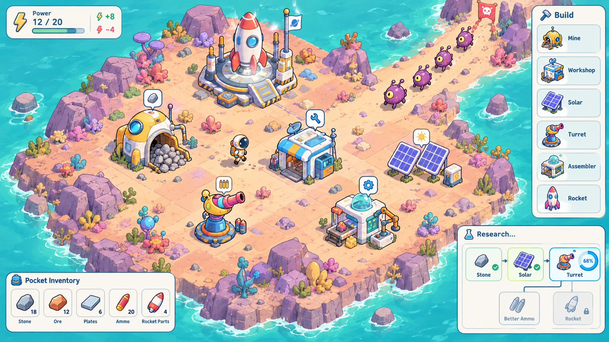

# Wrong Sky

> 英文名：**Wrong Sky** · 仓库：`wrong-sky` · 中文名待定

异星坠毁题材的轻度游戏：**简化工厂（无物流）+ 塔防守家 + 线索叙事 + 多结局**。  
**Isometric 2D**（2D 精灵 + 固定等距镜头，非真 3D）。面向轻度玩家 / 摸鱼向；技术意向为 TypeScript + Canvas 自研。

## 概念图

**v2（当前方向）**

**v1（对照，偏卡通）**

概念图，非实机截图。提示词：[docs/art/key-visual-prompt.md](./docs/art/key-visual-prompt.md)

## 文档索引

| 文件 | 说明 |
| ---- | ---- |
| [IDEAS.md](./IDEAS.md) | **想法**全文初稿。定稿后禁止修改。 |
| [CORRECTIONS.md](./CORRECTIONS.md) | **修正与增量**：调整旧想法，或追加全新想法；只增不减，条目带日期。 |
| [MVP.md](./MVP.md) | **第一版范围**：必须做 / 不做 / 完成定义；与 IDEAS 冲突时以本文件为准做第一版。 |
| [docs/art/](./docs/art/) | 概念图与美术提示词 |

阅读顺序：`IDEAS.md`（愿景）→ `MVP.md`（当前只做什么）→ `CORRECTIONS.md`（按日期的增量）。

## 分支约定

- **`master`：** 设计与文档基线（保持干净）。
- **`mvp`：** 能力与玩法验证沙盒；**不合回 `master`**。
- 暂不设 **`develop`**。细则见 [CORRECTIONS.md](./CORRECTIONS.md)（2026-09-23 条目）。

## 一句话卖点（摘自想法）

不用铺传送带的异星基地：口袋/仓库全局库存、建筑表控产、用电招怪、自动守家；中期线索解密世界；默认通关为化学引擎飞走（导航 + 休眠仓），另有治星/殖民/彩蛋等分支。
